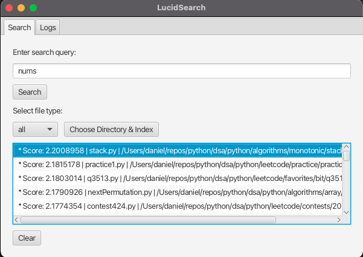

# Lucid Search Engine

---

Personal file search engine powered by Lucene.

## Overview

Lucid Search Engine is a lightweight, Java-based application that helps you index and search your personal files with lightning-fast relevance ranking, powered by Apache Lucene. 

It also includes a real-time file change watcher so that you can monitor any system modifications in real-time.


## Features
- File indexing and search capabilities
- File change watcher for real-time monitoring on system file changes (good for virus detection)
- Relevancy-based search results
- File type filtering (e.g., `.txt`, `.doc`, etc.)
- JavaFX-based user interface
- Log viewer for monitoring software activity

## GUI Preview


## Requirements
- Java JDK 17 or higher
- Maven

## Build & Run
Use the following command to build and run the application:

```bash
 mvn clean javafx:run
```

## License
Distributed under the MIT License.
